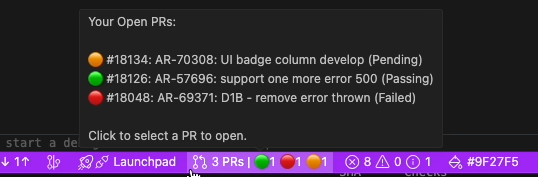
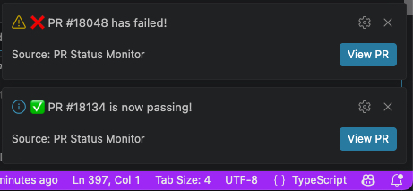

# 📡 PR Status Monitor

> **Stop refreshing GitHub.** Get real-time pull request CI status, smart notifications, and one-click navigation — all from your VS Code status bar.

[](https://code.visualstudio.com/)
[]()
[]()

---

<!-- 🎬 DEMO: Replace with an animated GIF showing the extension in action.
     Record a short GIF (15-30s) that shows:
       1. The status bar widget updating
       2. A notification popping up when a PR passes/fails
       3. Clicking the status bar to open a PR in the browser
     Tools: LICEcap, Gifox, or VS Code's built-in screen recorder.
     Save as assets/demo.gif and uncomment the line below:
-->
<!--  -->

## 🚀 Quick Start — 3 Steps

1. **Install** — Search for _"PR Status Monitor"_ in the VS Code Extensions panel, or click the button below:

   [](https://marketplace.visualstudio.com/items?itemName=ah584d.pr-status-monitor)

2. **Sign in to GitHub** — When prompted, authorize VS Code to access your GitHub account. The extension uses VS Code's built-in GitHub authentication — **no personal access tokens needed**.

3. **You're done!** — Open any workspace with a Git repo. Your PR statuses appear instantly in the status bar:

   

   _(3 open PRs: 1 passing, 1 failed, 1 pending)_


---

## ✨ Features

### 🚥 Real-time CI Status at a Glance

See the combined status of all your authored PRs across every repo and worktree in your workspace — without leaving your editor.

- 🟢 **Passing** — All checks succeeded
- 🟠 **Pending** — Checks still running
- 🔴 **Failed** — Action required

### 🔔 Smart Notifications

Get notified the moment a PR's status changes — no more anxiously refreshing the GitHub checks tab.

- ✅ _"PR #123 is now passing!"_ when a pending PR passes all checks
- ❌ _"PR #123 has failed!"_ when a pending PR fails
- Each notification includes a **"View PR"** button to jump directly to the PR



### 🤖 Copilot-Powered Failure Investigation

When a PR fails, let GitHub Copilot help you understand why — without leaving VS Code.

- Enable `prStatusMonitor.showInvestigateOnFailure` to activate this feature
- On failure, Copilot Chat **opens automatically** with a pre-filled prompt asking it to investigate the build failure
- The failure notification also gains an **"Investigate"** button as a manual re-trigger

### 🚀 Universal Worktree Support

Works seamlessly with multi-root workspaces and Git worktrees. Tracks PRs you authored across all repositories and worktrees open in your editor.

### 🖱️ One-Click Navigation

Click the status bar widget to open your latest active PR directly in your browser.

### 📊 Rich Tooltips

Hover over the status bar item to see an organized breakdown of all your open PRs and their individual build statuses.

### 🔄 Reliable Connectivity

Fast 10-second retry polling during startup and after connection loss — you're always up to date.

---

## ⚙️ Configuration

| Setting | Type | Default | Description |
|---------|------|---------|-------------|
| `prStatusMonitor.pollingInterval` | number | `2` | How often to check PR status (in minutes). Min: 0.5 (30s), Max: 60. |
| `prStatusMonitor.showInvestigateOnFailure` | boolean | `false` | When enabled, automatically opens Copilot Chat with a pre-filled investigation prompt when a PR build fails. Also adds an "Investigate" button to the failure notification. |

To change these settings:

1. Open Settings (`Cmd+,` / `Ctrl+,`)
2. Search for **"PR Status Monitor"**
3. Adjust the desired values

Or add to your `settings.json`:

```json
{
  "prStatusMonitor.pollingInterval": 0.5,
  "prStatusMonitor.showInvestigateOnFailure": true
}
```

---

## 📋 Requirements

| Requirement | Details |
|-------------|---------|
| VS Code | `1.103.0` or newer |
| GitHub | Signed in via VS Code's built-in GitHub auth |

---

## 🤔 Why PR Status Monitor?

| Without PR Status Monitor | With PR Status Monitor |
|--------------------------|----------------------|
| Alt-Tab to browser, navigate to GitHub, find your PR, check the status... repeat every 5 minutes | Glance at your status bar — done |
| Miss a failed check and waste 30 minutes waiting | Get notified instantly when your PR fails or passes |
| Forget which repo had the pending PR | All PRs from all open repos aggregated in one place |

---

## 👨‍💻 Author

Created with ❤️ by **Avraham Hamu**.

- 🏪 [VS Code Marketplace](https://marketplace.visualstudio.com/items?itemName=ah584d.pr-status-monitor)

---

## ⭐ Enjoying PR Status Monitor?

If this extension saves you time, consider:

- ⭐ [**Leave a review**](https://marketplace.visualstudio.com/items?itemName=ah584d.pr-status-monitor&ssr=false#review-details) on the VS Code Marketplace
- 🌟 [**Star the repo**](https://github.com/ah584d/vscode-plugin-pr-status) on GitHub
- 📣 **Share it** with your team — they'll thank you!
